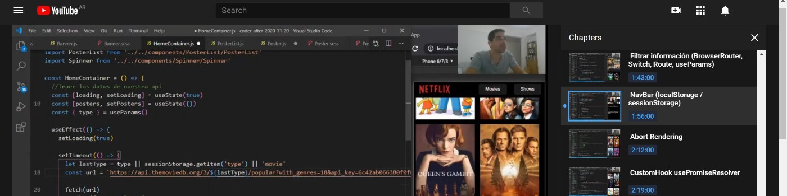

### https://www.linkedin.com/in/joseluisfriedrich/

Experienced software developer with more than 20 years of experience in diverse technology areas such as backend applications using .NET and machine learning using Python and Tensorflow.

Software Development and Coding, Software Architecture / Design, Project Management, Offshore / Distributed Team Management.

Backend: C#, Python, Tensorflow, Keras, SQL Server. TFS, Git.
Frontend: HTML, CSS, JavaScript, React.js, UX/UI. 

# Coderhouse After Class

2020-11-20 https://youtu.be/OyG5aqfeIQo - Integrador (Simil Netflix)

2020-11-17 https://youtu.be/Mxd4vxF9s68 - Consultas generales

2020-11-13 https://youtu.be/GJQ6npfucw8 - Clone Instagram (Integrador)

2020-11-03 https://youtu.be/vCa8SWxzkZM - After Hooks
